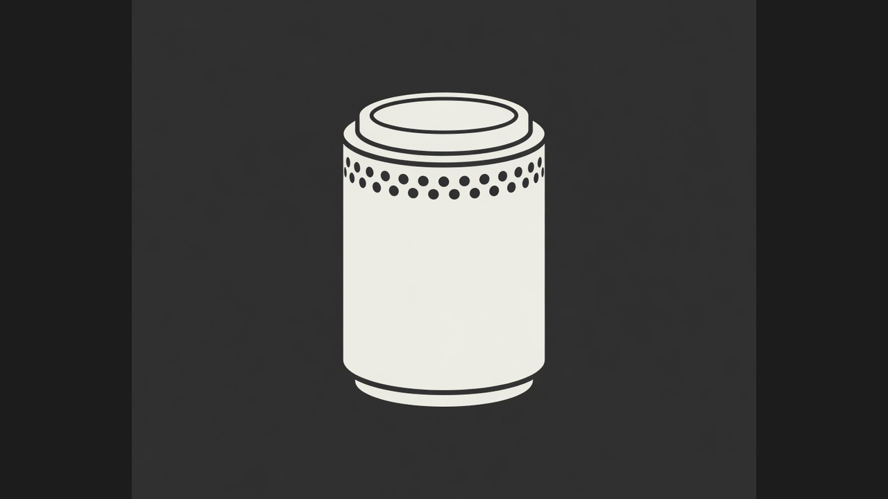

# Mac Pro 2013



The go-to plugin for a Late 2013 Mac Pro (aka Trashcan or Cylinder). Stock Omarchy leaves the second FirePro idle, kills the picture when you lock or Sleep, and can login-loop if DRM is wired wrong. This is everything the machine needs to run nicely: both GPUs (D300, D500 or D700), a lock that keeps the picture, Sleep off, auto Wi-Fi repair, and GPU per app. One Apply. Two machines already run it — a D700 and a D500.

Installing the plugin only puts the cylinder on the bar. **Apply** is the setup. One sudo in a terminal. Password once.

## What you get

- **Both FirePros** — the one with the cable drives the screen; the other renders. Pick a window in the bar; next launch from the menu uses that GPU.
- **A screen that comes back** — screensaver at 2.5 minutes, password at 5. The lock does **not** cut DisplayPort (stock Omarchy lock does, and only a power-button reboot recovers).
- **Sleep is off** — Suspend / Hibernate are masked. Power the machine off.
- **Wi-Fi that reconnects** when the Broadcom radio drops.
- **Login keymap** from your vconsole (AZERTY stays AZERTY).

## Install

```bash
omarchy plugin add https://github.com/nomdelasociete/omarchy-mac-pro-2013.git --enable
```

Bar → cylinder → **Apply · sudo in a terminal**.

That is the whole setup. `omarchy plugin add` does not sudo and does not touch the GPU.

## What it will not do

- Turn the Philips (or any DP panel) *off*. The 2013 FirePro cannot wake the link. Lock stays on a live signal.
- Make the internal BCM4360 as fast as Ethernet.
- `amdgpu.dc=0` (no picture). `gpu_recover` for a black screen (it makes it worse).

## Remove

Bar → **Remove profile**. The plugin can stay.

```bash
omarchy plugin remove nomdelasociete.macpro
```

Suspend stays masked. Do not unmask it on this hardware.

## Requirements

- Omarchy
- Late 2013 Mac Pro (`MacPro6,1`), two FirePro D300, D500 or D700
- A real terminal for the one sudo

MIT. `d700 <app>` still means “run this on the offload FirePro”, including on a D500.

## Privilege

Apply writes your session files as you. Root work is package `nomdelasociete-macpro` (`/usr/lib/nomdelasociete-macpro/`), owned by pacman, bytes in `packaging/digests.txt`.

Apply refuses unless `pacman -Qqo` is that package and the helper sha256s match. Missing package → GitHub Release v0.4.0 `.pkg.tar.zst` (sha256 checked), then verify again. No AUR. The plugin checkout is never copied into a root path.

PKGBUILD source is the v0.4.0 tarball (`147fe8a…`) with a real `sha256sums`, not `SKIP`.
